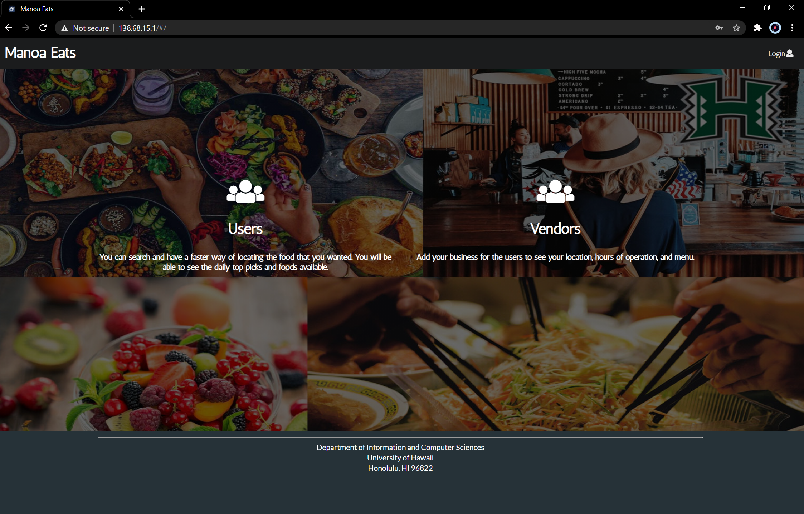
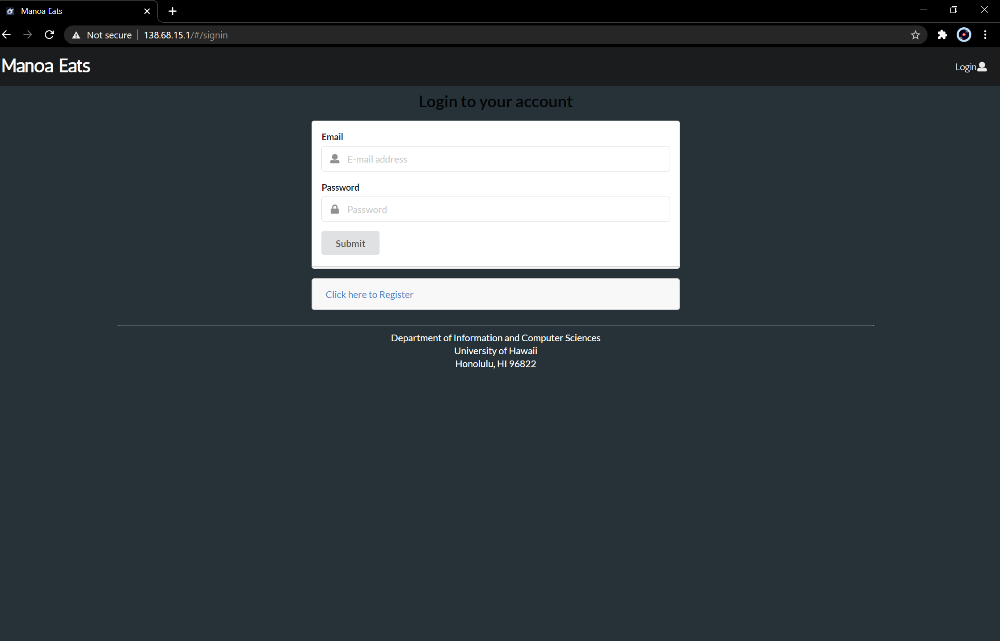
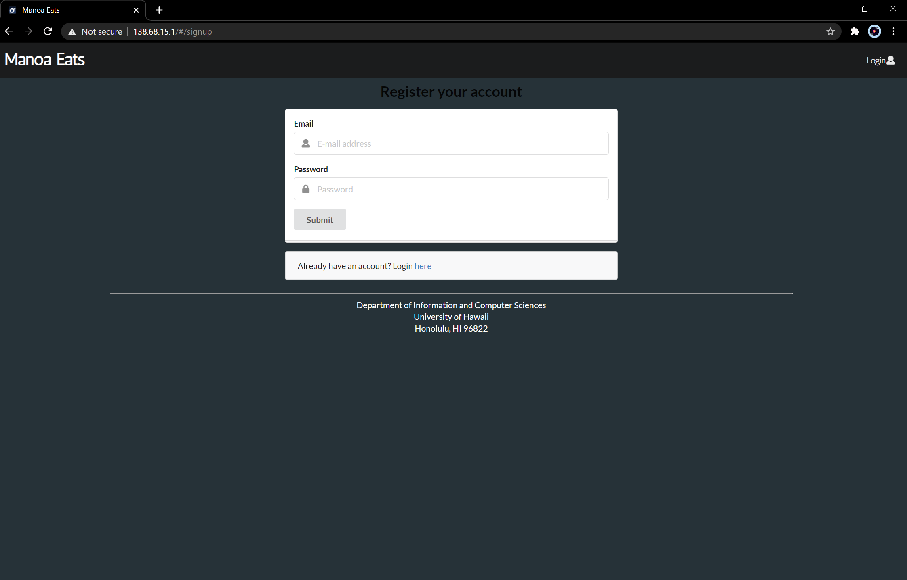
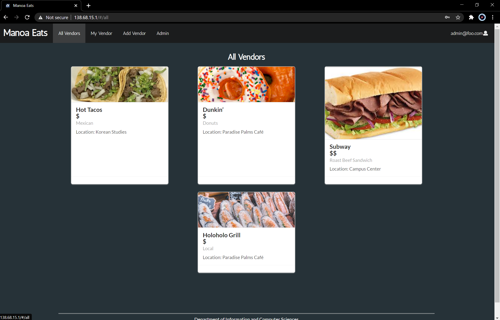
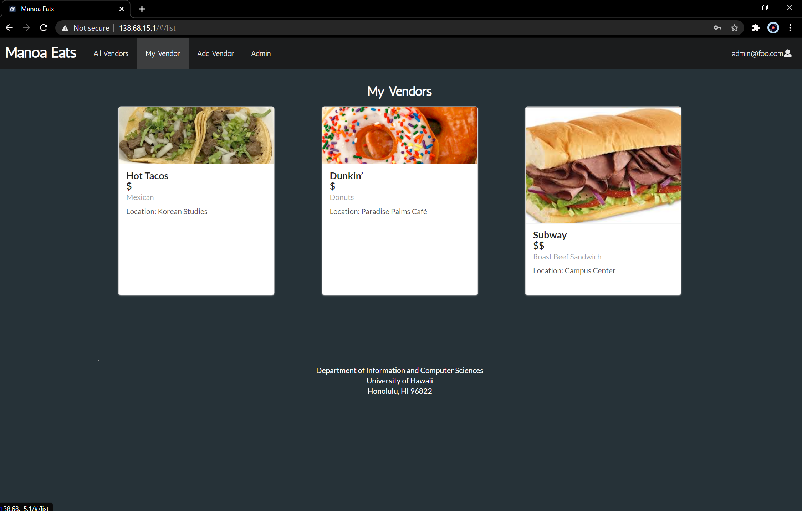
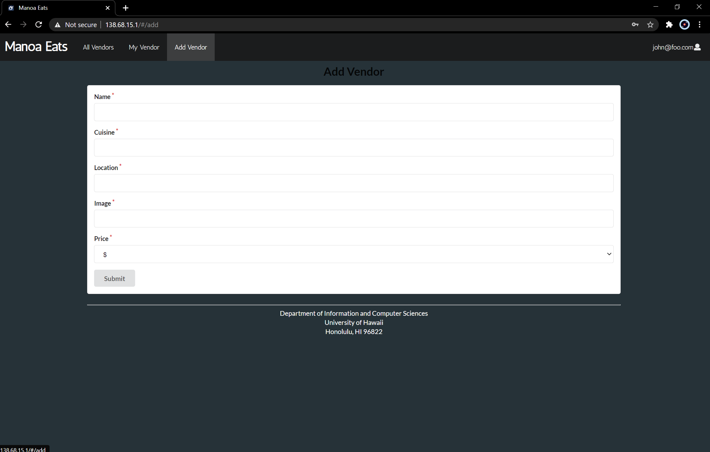
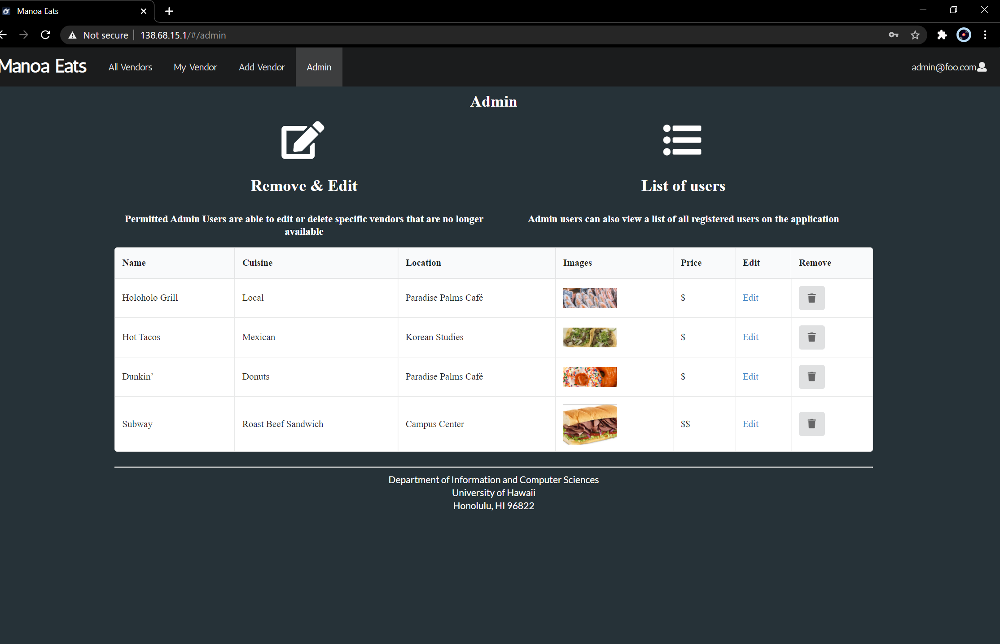

# Manoa Eats 

## Table of contents

* [Goal of Project](#goalofproject)
* [Overview](#overview)
* [User Guide](#userguide)

* [Development History](#developmenthistory)
* [Contact Us](#contactus)

## <a href="http://138.68.15.1/#/">Manoa Eats Website</a>

## Goal of Project

To help students find the food options throughout our campus that are available on a specific time. (available today)

## Overview

Manoa Eats is web application that helps students find different food choices of their desire that are available on the current time. 

Students at UH Manoa have the ability to sign into the app and search for whatever they are craving at that time. When you load up the application, you are greeted with a flanding page...
Everyday will have different availablities to ensure that there will be a wide range of food options. 
Vendors can also add their meals to the app for the students to see. 

## User Guide
  
  ### Landing page
  
  Landing page contains a brief introduction to the users and vendors about the website.
  
  
  
  ### Sign In Page
  
  Registered users can sign into the application. 
  
  
  
  ### Sign Up Page
  
  If the user does not have a registered account, they can sign up through this page.
  
  
  
  ### All Vendors page
  
  List all the vendors available at UH Manoa.
  
  
  
  ### My Vendor Page
  
  *This is a work in progress
  
  This page let users see their favorited vendors.
  
  
  
  ### Add Vendor page
  
  Registered vendors have the ability to add their own business to provide information about their meals to the students of UH Manoa.
  
  
  
  ### Admin Home page
  
  Verified admin users have the ability to edit or delete different types of vendors.
  
  

## Community Feedback

Although this is a work in progress application, we would like to hear your input on improving ManoaEats.
  
## Development History

Milestone 1: <a href="https://github.com/manoaeats/manoaeats/projects/1">Click Here</a>

Milestone 2: <a href="https://github.com/manoaeats/manoaeats/projects/2">Click Here</a>

Milestone 3: coming soon...

## Contact Us 

#### Jerome Gallego

Website: [Professional Portfolio](https://alohajerome.github.io/)
Email: gallego6@hawaii.edu

#### Christine Guira

Website: [Professional Portfolio](https://ceekaye12.github.io/)
Email: ckguira@hawaii.edu
  
#### Marjorie Raquiz

Website: [Professional Portfolio](https://mkraquiz.github.io/)
Email: mkraquiz@hawaii.edu
 
#### Yeji Han

Website: [Professional Portfolio](https://yejihan92.github.io/)
Email: hany7@hawaii.edu

