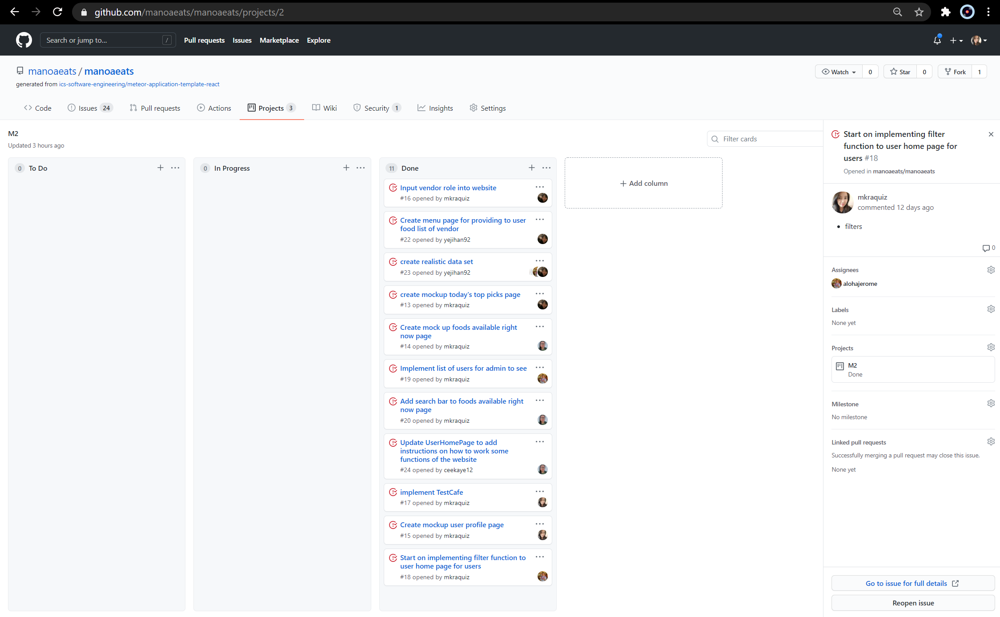

## Table of contents

* [Goal of Project](#goal-of-project)
* [Overview](#overview)
* [Deployment](#deployment)
* [User Guide](#user-guide)
* [Community Feedback](#community-feedback)
* [Developer Guide](#developer-guide)
* [Development History](#development-history)
* [Contact Us](#contact-us)

## Goal of Project

To help students find the food options throughout our campus that are available on a specific time. (available today)

## Overview

Manoa Eats is web application that helps students find different food choices of their desire that are available on the current time. 

Students at UH Manoa have the ability to sign into the app and search for whatever they are craving at that time. When you load up the application, you are greeted with a flanding page...
Everyday will have different availablities to ensure that there will be a wide range of food options. 
Vendors can also add their meals to the app for the students to see. 

## Deployment
#### You can take a quick look at our work-in progress website:
### <a href="http://manoaeats.xyz/">Here</a>

## User Guide
  
### Landing page
  
  Landing page contains a brief introduction to the users and vendors about the website.
  
  
  
### Sign In Page
  
  Registered users can sign into the application. 
  
  
  
### Sign Up Page
  
  If the user does not have a registered account, they can sign up through this page.
  
  

### Home Page

  Default home page once you log into your account
  
  
  
### All Vendors page
  
  List all the vendors available at UH Manoa.
  
  

### Today's Top Picks Page

  Lists the popular vendors on campus right now
  
  
  
### My Vendor Page
  
  *This is a work in progress
  
  This page let users see their favorited vendors.
  
  
  
### Add Vendor page
  
  Registered vendors have the ability to add their own business to provide information about their meals to the students of UH Manoa.
  
  
  
### Admin Home page
  
  Verified admin users have the ability to edit or delete different types of vendors. This now shows a list of registered accounts 
  
  
  
  
  

## Community Feedback

Although this is a work in progress application, we would like to hear your input on improving ManoaEats.

## Developer Guide

This section provides information to Meteor developers who are interested in using this code as a basis for their own development.

### Installation

First, [install Meteor](https://www.meteor.com/install)

Second, go to https://github.com/ics-software-engineering/meteor-application-template-react. Click the "Use this template" and create a new repository. 

Third, go to your newly created repository. Click the "Code" and choose if you want to "open with your GitHub Desktop" or "Download ZIP" to create a copy to your local computer.

Fourth, cd your app directory and install the libraries using:

 

Fifth, run the system using:

 

### Initialization

Run meteor reset to reset the system and restore the default data

 

### Run ESLint

To check that your system does not have any ESLint error, run:

 
  
## Development History

Milestone 1: <a href="https://github.com/manoaeats/manoaeats/projects/1">Click Here</a>

Milestone 2: <a href="https://github.com/manoaeats/manoaeats/projects/2">Click Here</a>

Milestone 3: <a href="https://github.com/manoaeats/manoaeats/projects/3">Click Here</a>

## Contact Us 

#### Jerome Gallego
Website: [Professional Portfolio](https://alohajerome.github.io/)

Email: gallego6@hawaii.edu

#### Christine Guira
Website: [Professional Portfolio](https://ceekaye12.github.io/)

Email: ckguira@hawaii.edu
  
#### Marjorie Raquiz
Website: [Professional Portfolio](https://mkraquiz.github.io/)

Email: mkraquiz@hawaii.edu
 
#### Yeji Han
Website: [Professional Portfolio](https://yejihan92.github.io/)

Email: hany7@hawaii.edu

